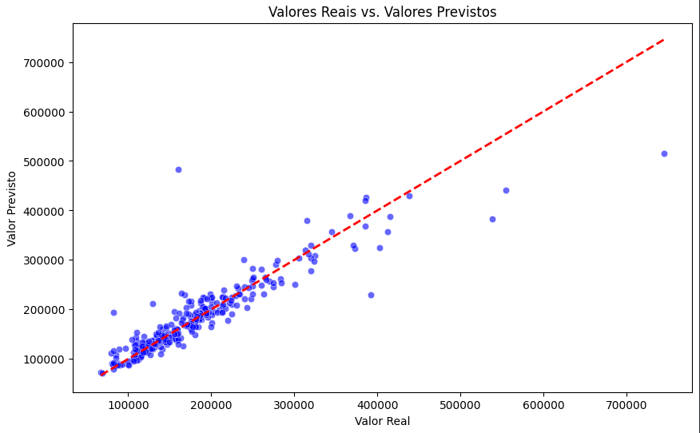
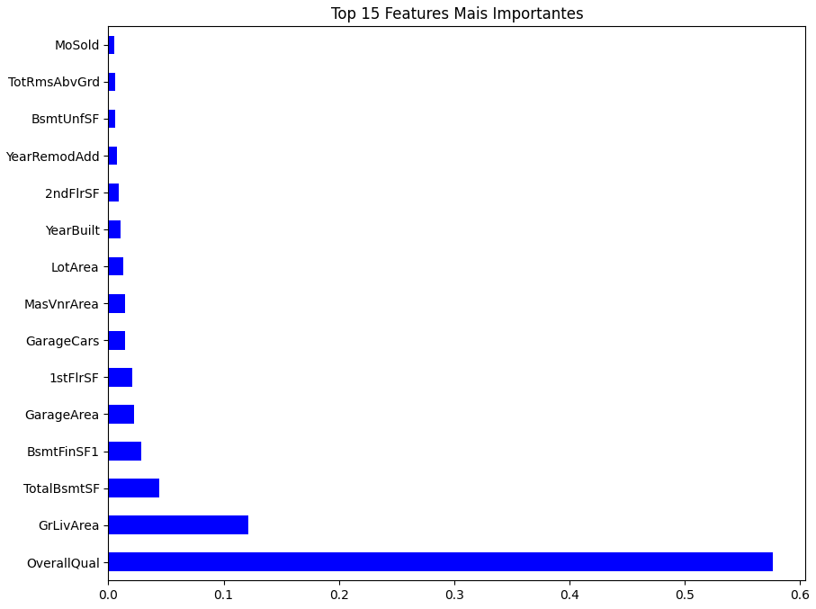

# 🏠 House Price Prediction com Random Forest

Este projeto aplica técnicas de Machine Learning para prever o preço de venda de imóveis com base em diversas características (features), como área do lote, ano de construção, bairro, etc.

O objetivo principal foi construir um pipeline robusto de processamento de dados e treinamento utilizando a biblioteca **Scikit-Learn**.

## 🛠 Tecnologias Utilizadas

* **Python**
* **Pandas & NumPy**
* **Scikit-Learn**
* **Matplotlib & Seaborn**

## 🧠 O Modelo

Foi utilizado o algoritmo **Random Forest Regressor**. A escolha se deve à sua capacidade de lidar bem com dados não-lineares e robustez contra overfitting em comparação a árvores de decisão simples.

O projeto implementa um **Pipeline** que automatiza:
1.  **Tratamento de dados numéricos:** Imputação de valores faltantes pela média.
2.  **Tratamento de dados categóricos:** Imputação e transformação One-Hot Encoding.
3.  **Treinamento:** Ajuste do modelo aos dados processados.

## 📊 Resultados

O modelo foi avaliado utilizando a métrica **MAE (Mean Absolute Error)**.

> **Erro Médio Absoluto (MAE):** $17,711.25 


### Visualizações

**1. Previsão vs. Realidade**
*O gráfico abaixo mostra a correlação entre os valores preditos pelo modelo e os valores reais de venda.*




**2. Importância das Features**
*As variáveis que mais impactaram na decisão de preço do modelo.*



## 🚀 Repositório

1. Clone o repositório:
   ```bash
   git clone https://github.com/1pablex/house-prices-prediction.git
